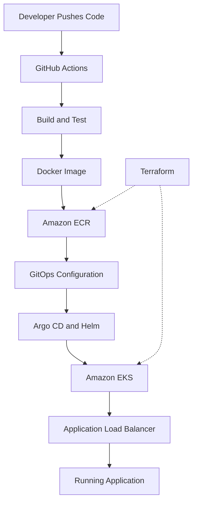

# AfterPush

### From Git Push to Cloud Deployment

**AfterPush** is a cloud-native DevOps and Platform Engineering project built on AWS. It focuses on automating containerized application delivery, managing infrastructure as code, and implementing secure CI/CD and GitOps workflows.

The long-term goal is to build a **self-service deployment platform** where developers can connect a GitHub repository, deploy applications, and manage deployments without manually configuring AWS or Kubernetes.

> **Project Status:** The AWS CI/CD and GitOps deployment architecture has been implemented and validated. Self-service platform features are currently planned.

## Architecture



**Deployment workflow:** GitHub Actions builds and publishes container images to Amazon ECR. GitOps configuration and Argo CD manage application deployment to Kubernetes on Amazon EKS.

**Infrastructure:** Terraform manages AWS resources, with remote state stored in Amazon S3.

**Security:** GitHub Actions uses AWS OIDC authentication and IAM roles instead of long-lived access keys.

## Tech Stack

| Category | Technologies |
|---|---|
| Cloud | AWS EKS, ECR, VPC, IAM, ALB, S3 |
| Infrastructure as Code | Terraform |
| Containers | Docker, Kubernetes, Helm |
| CI/CD | GitHub Actions |
| GitOps | Argo CD |
| Backend | TypeScript, Node.js, Express |
| Security | AWS IAM, OIDC, Security Groups |

## Implemented Features

- **Infrastructure Automation:** Provisioned AWS infrastructure using Terraform, including VPC networking, IAM roles, and EKS.
- **Containerization:** Built a Docker-based TypeScript/Express application.
- **CI/CD Pipeline:** Automated container image builds and publishing to Amazon ECR using GitHub Actions.
- **Secure AWS Authentication:** Integrated GitHub Actions with AWS through OIDC and IAM roles.
- **GitOps Deployment:** Implemented Kubernetes deployments using Helm and Argo CD.
- **Deployment Validation:** Successfully verified application health and version endpoints through AWS load balancing.
- **Terraform State Management:** Separated persistent AWS resources from temporary EKS infrastructure using independent remote state configurations.

> **Cost Management:** The EKS environment was deployed, tested, and subsequently destroyed to avoid unnecessary AWS charges. Persistent resources such as ECR and IAM roles were retained.

## Engineering Decisions

| Decision | Why? |
|---|---|
| Terraform | Reproducible infrastructure and version-controlled configuration |
| Kubernetes / EKS | Container orchestration and application lifecycle management |
| GitHub Actions | Automated build and delivery workflows |
| Argo CD | GitOps-based deployment and configuration synchronization |
| AWS OIDC | Secure authentication without stored AWS access keys |
| Separate Terraform States | Independent lifecycle management of persistent and temporary resources |
| Helm | Reusable and configurable Kubernetes deployments |

## Getting Started

### Prerequisites

- Node.js and npm
- Docker (optional, for containerized execution)

### Run Locally

```bash
git clone https://github.com/EthemKesim/AfterPush.git
cd AfterPush/app

npm install
npm run dev
```

Verify the API:

```bash
curl http://localhost:3000/health
```

### Run with Docker

From the `app` directory:

```bash
docker build -t afterpush-api .
docker run -p 3000:3000 afterpush-api
```

Test the container:

```bash
curl http://localhost:3000/health
```

> **AWS Deployment:** Provisioning the cloud infrastructure requires AWS credentials, Terraform, Kubernetes tooling, and appropriate IAM permissions. AWS resources may incur charges.

## Roadmap

### Phase 1 — Cloud & DevOps Foundation

- [x] TypeScript backend and Docker containerization
- [x] AWS infrastructure provisioning with Terraform
- [x] Amazon ECR integration
- [x] GitHub Actions CI/CD with AWS OIDC
- [x] Kubernetes deployment on Amazon EKS
- [x] Helm and Argo CD GitOps
- [x] Application health checks
- [x] Terraform remote state separation

### Phase 2 — Reliability & DevSecOps

- [ ] Automated testing and security scanning
- [ ] Prometheus, Grafana, and centralized logging
- [ ] Deployment rollback and failure recovery
- [ ] Kubernetes resource limits and autoscaling

### Phase 3 — Self-Service Platform MVP

- [ ] GitHub repository onboarding
- [ ] Project and deployment management API
- [ ] React-based web dashboard
- [ ] One-click application deployment
- [ ] Deployment history and status tracking
- [ ] Application logs and rollback controls

**MVP Goal:** Enable developers to connect a supported GitHub repository and deploy an application to AWS through a simple interface.

## Project Structure

```text
AfterPush/
├── app/          # TypeScript backend
├── terraform/    # AWS infrastructure
├── helm/         # Kubernetes Helm configuration
├── argocd/       # Argo CD resources
├── gitops/       # GitOps manifests
├── k8s/          # Kubernetes configuration
├── platform/     # Platform development
├── .github/      # CI/CD workflows
└── README.md
```

## Author

**Ethem Kesim**  
Software Engineering Student | Cloud, DevOps & Platform Engineering

[GitHub](https://github.com/EthemKesim) · [LinkedIn](https://www.linkedin.com/in/ethemkesim/)
